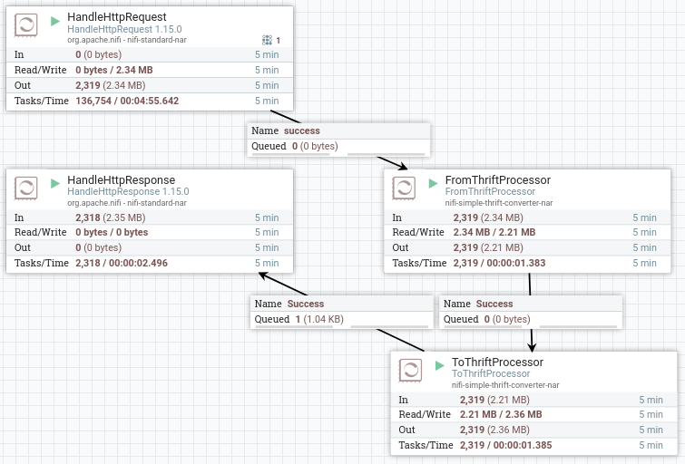
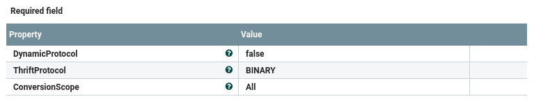
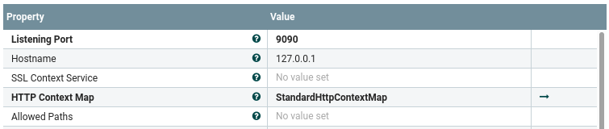
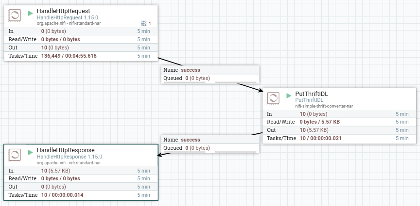

# nifi-simple-thrift-converter

A suite of processors to allow content and attribute ingrees and egress with NiFi using the the [Apache Thrift](https://thrift.apache.org) protocol.

**Author** : [David Turland](#author)


[//]: <> (doctoc --github --entryprefix "*" --title "## Table of Contents" README.md)
<!-- START doctoc generated TOC please keep comment here to allow auto update -->
<!-- DON'T EDIT THIS SECTION, INSTEAD RE-RUN doctoc TO UPDATE -->
## Table of Contents

- [Summary](#summary)
- [Description](#description)
- [Apache Trift](#apache-trift)
- [Build and Installation](#build-and-installation)
  - [Build the NiFi Nar file](#build-the-nifi-nar-file)
- [Developing clients for Nifi Thrift](#developing-clients-for-nifi-thrift)
  - [Obtaining the thrift file](#obtaining-the-thrift-file)
  - [The thrift file (Mapping of content and attributes)](#the-thrift-file-mapping-of-content-and-attributes)
  - [Example FromThriftprocessor and ToThriftProcessor](#example-fromthriftprocessor-and-tothriftprocessor)
  - [FromThriftProcessor and ToThriftProcessor Properties](#fromthriftprocessor-and-tothriftprocessor-properties)
- [Unit Tests, Client examples,tests and benchmarks](#unit-tests-client-examplestests-and-benchmarks)
  - [Unit Tests](#unit-tests)
  - [Client examples,tests and benchmarks](#client-examplestests-and-benchmarks)
- [Benchmarking notes](#benchmarking-notes)
- [TODO](#todo)
- [Licence](#licence)
- [Author](#author)
- [Useful Links](#useful-links)
  - [Apache Thrift](#apache-thrift)
  - [Apache NiFi](#apache-nifi)
  - [Testing ( Mock and unit tests)](#testing--mock-and-unit-tests)

<!-- END doctoc generated TOC please keep comment here to allow auto update -->
# Summary


[Apache Thrift](https://thrift.apache.org) is an alternative to other transport protocols, eg [Google Protocol Buffers](https://developers.google.com/protocol-buffers/), and [Apache Avro](https://avro.apache.org)

nifi-simple-thrift-converter comprises three NiFi processors:
- **FromThriftProcessor** - converts serialised Thrift object in the flowfile content to Flowfile content and attributes
- **ToThriftProcessor** - converts Flowfile content and attributes to a Thrift object and serialises to the flowfile content
- **PutThriftIDL** - returns the Thrift IDL as the flowfile content. Useful to allow extracting the Thrift IDL file from a Running NiFi

**NOTE** The processors are _not_ edge processors, ingress and egrees to NiFi can be provided by standard NiFi processors, eg
- HTTTPRequest
- HTTResponse

These processors wil be useful if your existing workflow ultilises Thrift, or there is that Thrift killer-feature, eg [better language support](https://thrift.apache.org/docs/Languages.html)

# Description
nifi-simple-thrift-converter provides a number of features:
* NiFi-prescribed thrift specification
* These processors work with a fixed Thrift IDL specification: a Thrift FlowFile struct which largely mimics a NiFi flowfile, with 'attributes', and 'content'.
* This allows arbitrary flowfiles to be converted(serialised) to Thrift, and conversely, deserialised Thrift structs to flow intact within NiFi, with the NiFi attribute,content look and feel

If your requirement is to have custom data structures enter, exit and flow around NiFi(captured in say JSON) then maybe Avro is the better option. Though FlowFile content can always be JSON


# Build and Installation
## Thrift Version
Requires thrift>=0.16.0
## Build the NiFi Nar file
### Prerequisites
- Ensure [Apache Thrift](https://thrift.apache.org) is installed.
	- If your thrift version is not as per thrift.version in [pom.xml](pom.xml) then this
will require defining on the maven cli, eg ```mvn -Dthrift.version=0.16.0 package```
- NiFi Version
	- If your NiFi version is not as per NiFi.version in [pom.xml](pom.xml) then this
will also require defiinng on the maven line, eg ```mvn -Dnifi.version=2.0.0-SNAPSHOT package```
- build and deploy processors
```bash
# nifi is installed in dir NIFI_DIR
mvn package
# or maybe
mvn -Dthrift.version=0.16.0 package
# or even
mvn -Dthrift.version=10.16.0 -Dnifi.version=2.0.0-SNAPSHOT package
cp nifi-simple-thrift-converter-nar/target/nifi-simple-thrift-converter-nar-2.0.0-SNAPSHOT.nar \
   $NIFI_DIR/lib
```

Although supposedly there is support for runtime [autoload of nars](https://www.nifi.rocks/auto-loading-extensions/)
see property in nifi.properties:
> nifi.nar.library.autoload.directory=./extensions

In which case:
```bash
cp nifi-simple-thrift-converter-nar/target/nifi-simple-thrift-converter-nar-2.0.0-SNAPSHOT.nar\
   $NIFI_DIR/extension
```

# Developing clients for Nifi Thrift

## Obtaining the thrift file
  -   from repo ( nifi-simple-thrift-converter-processors/src/main/resources/flowfile_nifi.thrift)
  -   at runtime via PutThriftIDL processor ( see below )

## The thrift file (Mapping of content and attributes)
Two classes,FlowFileRequest, and FlowFileReply used for passing requests to NiFi and holding responses, respectively.
Both contain a ThriftFlowFile which is akin to a NiFi flowfile

```java
  struct ThriftFlowFile{
   3: map<string,string> attributes,
   15: binary content,
}
```
1. **NOTE** To avoid name collisions, attributes in ThriftFlowFile.attributes, eg 'xxx' are prefixed with 'thrift.attr' ('thrift.attrr.xxx')
when copied to flowfile attributes

1. ThriftFlowFile.content is coped verbatim to flowfile content

## Example FromThriftprocessor and ToThriftProcessor

This is a simple round-trip example



In practice:
- The FromThriftProcessor SUCCESS would flow to '*many things*'
- The HandleHttpResponse might just return success or failure flowed from some
downstream process


## FromThriftProcessor and ToThriftProcessor Properties



- **ThriftProtocol** - The Thrift protocol to be used (~~unless dynamic protocol set~~) for:
  -  serialisation (ToThriftProcessor)
  -  deserialisation (FromThriftProcessor)
- **DynamicProtocol (TODO)** - should the required Thrift protocol be dynamic (per flowfile)
                              with the protocol specified in the a thrift object attribute?
- **ConversionScope** - what members of the Thrift FlowFile are converted
  - **All** - both the 'content' and 'attributes' members
  - **Attributes** - only the 'attributes' member
  - **Content**  - only the 'content' member



### PutThriftIDL Processor

This allows extracting the Thrift IDL file being used in a Running Nifi



Testing:
```bash
curl http://localhost:9091 --output /tmp/flowfile.thrift
  % Total    % Received % Xferd  Average Speed   Time    Time     Time  Current
                                 Dload  Upload   Total   Spent    Left  Speed
100  1602    0  1602    0     0  53367      0 --:--:-- --:--:-- --:--:-- 55241
```

# Unit Tests, Client examples,tests and benchmarks
## Unit Tests
[These](nifi-simple-thrift-converter-processors/src/test/java/turland/org/processors/thrift) are run automatically.

## Client examples,tests and benchmarks

| Client   | HTTP Client | Benchmark   |
|-----------------------------------------|:-----:|--------------------|
| [Java](examples/java/README.md)         |  Y    |   [JMH](https://github.com/openjdk/jmh)             |
| ~~[Perl](examples/perl/README.md)~~         |  ~~Y~~   |   ~~[Benchmark](https://perldoc.perl.org/Benchmark)~~       |
| [Python](examples/python/README.md)     |  Y    |                   |


# Benchmarking notes
The java http client example is *also* a JMH test (    https://github.com/openjdk/jmh )
```bash
cd examples/java
mvn clean verify
java -jar target/benchmarks.jar
```

The Perl (NO LONGER MAINTAINED) example also contained a simple Benchmark (10 kB content) (https://perldoc.perl.org/Benchmark)
```bash
cd examples/perl
bash build.bash
...
Benchmark: running simple for at least 1 CPU seconds...
    simple:  6 wallclock secs ( 0.94 usr +  0.13 sys =  1.07 CPU) @ 224.30/s (n=240)
```

# TODO
-  [ ] matrix of Example (transport, language)
-  [ ] Improve 'Failure' RELATIONSHIP
-  [ ] Optimise packing, unpacking of flow
-  [ ] Remove the expensive 'id' member
-  [ ] Performance results on sensible hardware
-  [ ] (Mock)Performance comparison with Apache Avro
	-  https://github.com/apache/nifi/blob/master/nifi-nar-bundles/nifi-standard-bundle/nifi-standard-processors/src/test/java/org/apache/nifi/processors/standard/TestValidateRecord.java
-  [ ] Support arrays of flowFile structs RecordSets


# Licence
__nifi-simple-thrift-converter__ is copyright 2021 David Turland

__nifi-simple-thrift-converter__ is released under the Apache Licence 2.0

# Author
**David Turland**
Still passionate, after over 25 years in HPC, about developing robust, performant<sup>[[1]](#myfootnote1)</sup>, software, libraries, frameworks, to hide the vagaries, yet exploit the possibilities of whatever future hardware arrives.

# Useful Links
[Apache Avro](https://avro.apache.org)
## Apache Thrift
* [Apache Thrift](https://thrift.apache.org)
* [Thrift: The Missing Guide](https://diwakergupta.github.io/thrift-missing-guide/)

### Maven .m2/settings.xml

```xml
<settings xmlns="http://maven.apache.org/SETTINGS/1.0.0" xmlns:xsi="http://www.w3.org/2001/XMLSchema-instance"
  xsi:schemaLocation="http://maven.apache.org/SETTINGS/1.0.0 https://maven.apache.org/xsd/settings-1.0.0.xsd">
    <!-- https://www.baeldung.com/maven-settings-xml
       mvn -X clean
       mvn help:effective-settings
    -->
    <profiles>
        <profile>
            <id>windows-profile</id>
            <activation>
                <activeByDefault>false</activeByDefault>
                <os>
                    <name>Windows 10</name>
                    <family>Windows</family>
                    <arch>amd64</arch>
                    <version>10.0</version>
                </os>
            </activation>
            <properties>
                <thrift.executable>${user.home}\bin\thrift-0.16.0.exe</thrift.executable>
                <thrift.version>0.13.0</thrift.version>
            </properties>
        </profile>
            <id>linux-profile</id>
            <activation>
                <activeByDefault>false</activeByDefault>
                <os>
                    <family>unix</family>
                </os>
            </activation>
            <properties>
                <thrift.executable>/usr/bin/thrift</thrift.executable>
                <thrift.version>0.16.0</thrift.version>
            </properties>
        </profile>
    </profiles>
</settings>
```

## Apache NiFi
* [Apache NiFi](https://nifi.apache.org/)
* [Autoload of nars](https://www.nifi.rocks/auto-loading-extensions/)

# Apache Trift
Thrift, is an alternative to say protobuf,Avro, where
- Thrift supports many languages ( more than protobuf )
- Thrift offers an efficient binary format ( and JSON, etc)
- though, and more likely, you already use Thrift in-house


**NOTE** Avro, a newer self-describing protocol, is already supported within [NiFi Services](https://nifi.apache.org/docs/nifi-docs/components/nifi-docs/)


## Testing ( Mock and unit tests)
Assembling flows:
 * https://touk.pl/blog/2019/01/10/testing-nifi-flow-the-good-the-bad-and-the-ugly/
 * https://www.javatips.net/api/nifi-master/nifi-mock/src/main/java/org/apache/nifi/util/MockProcessSession.java
 * https://www.nifi.rocks/developing-a-custom-apache-nifi-processor-unit-tests-partI/

<a name="myfootnote1">1</a>: Arbitrary footnote
